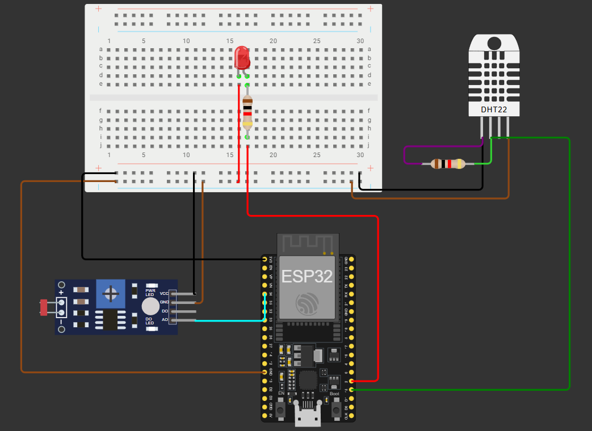

<h1 align="center">🌡️ Projeto IoT com ESP32 — Monitoramento Ambiental da Vinheria Agnello (FIWARE + MQTT)</h1>

## 📘 Descrição Geral
Este projeto implementa um sistema **IoT** com o **ESP32**, integrando os sensores **DHT22 (temperatura e umidade)** e **LDR (luminosidade)** para o monitoramento de ambientes em tempo real.  
Os dados são enviados via **protocolo MQTT**, no formato **JSON compatível com o padrão NGSIv2 do FIWARE**, permitindo integração com plataformas como o **Orion Context Broker** e dashboards inteligentes.

📍 **Cenário de Aplicação:** monitoramento ambiental da **adega da Vinheria Agnello**, onde temperatura, umidade e luminosidade influenciam diretamente a conservação dos vinhos.

---

## 🧠 Objetivos do Projeto
- Capturar dados ambientais (temperatura, umidade e luminosidade) com precisão;  
- Enviar as informações via **MQTT** para um **servidor configurável (por IP)**;  
- Garantir compatibilidade com o padrão **NGSIv2 (FIWARE)**;  
- Possibilitar integração com **dashboards** e **bancos de dados históricos**;  
- Validar o envio de dados por meio de aplicativos MQTT como o **MyMQTT**.

---

## ⚙️ Componentes Utilizados

| Componente | Quantidade | Função |
|-------------|-------------|--------|
| ESP32 DevKit | 1 | Microcontrolador principal |
| Sensor DHT22 | 1 | Mede temperatura e umidade |
| Sensor LDR | 1 | Mede intensidade luminosa |
| Resistor 10kΩ | 1 | Pull-up do pino de dados do DHT22 |
| Protoboard + Jumpers | — | Montagem dos circuitos |

---

## 🔌 Esquema de Ligação

| Componente | Pino ESP32 | Observação |
|-------------|-------------|-------------|
| **DHT22 - VCC** | 3V3 | Alimentação |
| **DHT22 - DATA** | GPIO 15 | Comunicação digital |
| **DHT22 - GND** | GND | Terra |
| **LDR - VCC** | 3V3 | Alimentação |
| **LDR - GND** | GND | Terra |
| **LDR - OUT (analógico)** | GPIO 34 | Entrada analógica |

🖼️ **Diagrama de Montagem:**  


---

## 🛰️ Fluxo de Dados IoT
```
[DHT22 + LDR] 
   ↓
[ESP32] 
   ↓ (via Wi-Fi)
[Broker MQTT - IP configurável] 
   ↓
[Aplicativo MyMQTT / FIWARE Orion / Dashboard]
```

- O ESP32 coleta as leituras dos sensores e gera um **timestamp via NTP (horário de Brasília)**.  
- Em seguida, envia os dados para um **broker MQTT**, local ou remoto.  
- Os dados são estruturados em formato **JSON** e podem ser consumidos por qualquer sistema compatível com **MQTT** ou **FIWARE**.

---

## 🧾 Estrutura dos Dados (JSON - NGSIv2)

```json
{
  "timestamp": "2025-10-20 21:15:00",
  "temperatura": 26.5,
  "umidade": 58.2,
  "luminosidade": 47.8
}
```

---

## 📡 Tópicos MQTT

| Tópico | Conteúdo Publicado |
|--------|--------------------|
| `/TEF/device001/attrs` | JSON completo (todas as medições) |
| `/TEF/device001/attrs/timestamp` | Timestamp NTP |
| `/TEF/device001/attrs/temperatura` | Temperatura (°C) |
| `/TEF/device001/attrs/umidade` | Umidade (%) |
| `/TEF/device001/attrs/luminosidade` | Luminosidade (%) |

---

## 🧠 Configuração do Ambiente

### 🔧 Requisitos
- **Plataforma:** Arduino IDE, PlatformIO ou [Wokwi Simulator](https://wokwi.com) 

💡 **Dica:** o [Wokwi](https://wokwi.com) permite testar todo o projeto **de forma online**, incluindo o ESP32, o sensor **DHT22**, o **LDR** e a comunicação **MQTT**.  
Ideal para validação do código antes da execução em hardware físico.

- **Placa:** ESP32 Dev Module / ESP32 DevKit
- **Bibliotecas necessárias:**
  - `WiFi.h`
  - `PubSubClient.h`
  - `Adafruit_Sensor.h`
  - `DHT.h`
  - `DHT_U.h`
  - `time.h`

---

### 🌐 Configurações Editáveis

Essas configurações permitem adaptar o projeto para **qualquer rede Wi-Fi ou broker MQTT**, bastando alterar os valores conforme o ambiente de uso.

```cpp
// === CONFIGURAÇÕES EDITÁVEIS ===
const char* SSID = "Wokwi-GUEST";           // Rede Wi-Fi (2.4GHz)
const char* PASSWORD = "";                  // Senha da rede
const char* BROKER_MQTT = "test.mosquitto.org";  // IP do Broker MQTT (substitua pelo seu)
const int BROKER_PORT = 1883;               // Porta do Broker MQTT
```

🔸 **Importante:**  
- Substitua `"test.mosquitto.org"` pelo **IP do seu servidor MQTT** quando estiver em produção.  
- Durante testes, você pode usar o broker público `test.mosquitto.org`.  
- É possível também mudar o **SSID** e **PASSWORD** para conectar em outras redes Wi-Fi, conforme a necessidade do ambiente de teste ou execução.

---

## 🧪 Testes e Validação

- Testado com o **MyMQTT (Android)**.  
- Envio de dados a cada **4 segundos**.  
- Timestamp sincronizado via **NTP (GMT-3 - Horário de Brasília)**.  
- Leituras confiáveis e coerentes com as condições do ambiente.  
- Comunicação **unidirecional validada** (publicação de tópicos).

🖼️ *Exemplo de publicação via MQTT:*  


---

## 🧰 Estrutura do Projeto

```
📦 Projeto_IoT_Vinheria
├── 📁 src
│   ├── main.ino              # Código principal do ESP32
├── 📁 imagens
│   ├── image.png             # Esquemático do circuito
│   ├── mqtt_teste.png        # Evidência de comunicação MQTT
├── README.md                 # Documento explicativo e replicável
```

---

## 🚀 Próximos Passos
- Desenvolver **dashboards** personalizados para visualização em tempo real;  
- Criar **alertas automáticos** (ex.: temperatura > 25°C ou baixa luminosidade);  
- Futuramente, implementar **atuadores** (ex.: ventilação ou iluminação automática).

---

## 👨‍💻 Autor
**Yan Barutti**  
FIAP — Engenharia de Software  
📅 *Check Point 5 – Edge Computing (2025)*  
📫 [LinkedIn](#) | [GitHub](#)

**Leonardo Silva**  
FIAP — Engenharia de Software  
📅 *Check Point 5 – Edge Computing (2025)*  
📫 [LinkedIn](#) | [GitHub](#)

**Guilherme Araújo**  
FIAP — Engenharia de Software  
📅 *Check Point 5 – Edge Computing (2025)*  
📫 [LinkedIn](#) | [GitHub](#)

**Samuel Monteiro**  
FIAP — Engenharia de Software  
📅 *Check Point 5 – Edge Computing (2025)*  
📫 [LinkedIn](#) | [GitHub](#)

**Lucas Toledo**  
FIAP — Engenharia de Software  
📅 *Check Point 5 – Edge Computing (2025)*  
📫 [LinkedIn](#) | [GitHub](#)

